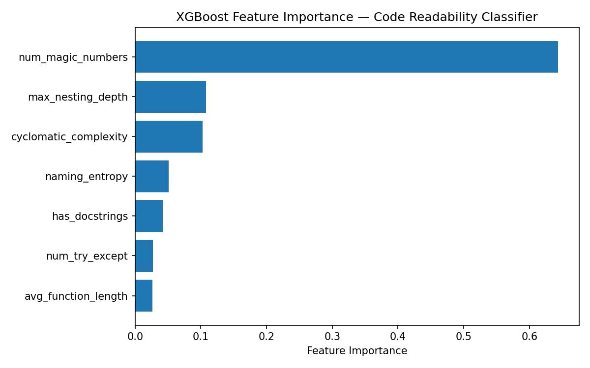

# ML Code Reviewer

Static analysis meets machine learning. Parses Python source into an AST, extracts structural features, scores readability with a trained XGBoost classifier, and generates targeted refactoring suggestions grounded in the measured metrics — not in an LLM's guess about what might be wrong.

**Live API:** [your-render-url.onrender.com/docs](https://your-render-url.onrender.com/docs)
**VS Code Extension:** [marketplace link](https://marketplace.visualstudio.com/)

---

## Demo



*Running the reviewer on a deeply nested function — score appears in the status bar, suggestions open in a side panel.*

---

## Why This Isn't a ChatGPT Wrapper

The obvious version of this tool sends code to an LLM and asks "review this." That approach has three problems: the model invents issues that aren't there, every request costs money regardless of whether the code has problems, and the same input produces different output run to run.

This tool separates deterministic analysis from language generation.

A Python AST walk measures nesting depth, naming patterns, magic numbers, and docstring coverage. Radon computes cyclomatic complexity. Those seven numbers feed an XGBoost classifier that outputs a readability probability. Only when specific thresholds are breached does the system call GPT-4o-mini — and the prompt contains the exact failed metrics with an instruction not to invent anything beyond them.

Clean code triggers zero API calls. Suggestions are anchored to measured facts. Results are reproducible.

---

## Architecture

```
Python source
      │
      ├──► ast.parse() ──► FeatureExtractor (NodeVisitor)
      │                      ├─ max_nesting_depth
      │                      ├─ naming_entropy
      │                      ├─ num_magic_numbers
      │                      ├─ has_docstrings
      │                      └─ avg_function_length
      │
      └──► radon ──► cyclomatic_complexity, maintainability_index
                          │
                          ▼
              XGBoost classifier ──► readability_score (0.0–1.0)
                          │
                          ▼
              threshold check ──► no issues? ──► return, 0 API calls
                          │
                          └─ issues found ──► grounded prompt ──► GPT-4o-mini
                                                                      │
                                                                      ▼
                                                         3 targeted suggestions
```

---

## Design Decisions

**Why AST features instead of raw code to the LLM**
AST extraction is deterministic and free. The classifier runs locally in milliseconds. Filtering on structural thresholds before calling the API cuts LLM usage substantially on typical codebases, and grounding the prompt in measured values prevents the model from hallucinating problems that don't exist in the source.

**Why `ast.Store` filtering in `visit_Name`**
Every variable reference appears in the AST as a `Name` node, both on assignment and on every read. Counting all of them would let a single variable used ten times skew the naming metric tenfold. Filtering to `ast.Store` context counts each variable once, at the point it's defined.

**Why radon instead of hand-rolling complexity**
Cyclomatic complexity is a standardized metric with well-defined edge cases — nested comprehensions, boolean operator chains, lambda bodies, ternary expressions. Radon is the mature implementation used inside production linters. The AST features are custom because they're specific to this tool; complexity is not, so reimplementing it would add risk without adding value.

**Why cross-validation instead of a single split**
A single train/test split gives one number that might be a lucky draw. Five-fold CV reports a mean and standard deviation, so the stability of the estimate is visible rather than assumed.

---

## Feature Importance


Cyclomatic complexity and naming entropy carry the most predictive weight. `num_try_except` sits near zero — expected, since error handling isn't clearly good or bad for readability and the training data was deliberately constructed with no class separation on that column. Its low importance is a sanity check that the model is learning real signal rather than memorizing noise.

---

## Metrics Extracted

| Feature | Source | What it measures |
|---|---|---|
| `cyclomatic_complexity` | radon | Independent paths through the code — a proxy for how many test cases full branch coverage requires |
| `max_nesting_depth` | AST | Deepest level of nested functions, loops, and conditionals |
| `naming_entropy` | AST | Fraction of assigned variable names longer than 2 characters |
| `avg_function_length` | AST | Mean number of statements per function |
| `has_docstrings` | AST | Whether any function carries a docstring |
| `num_magic_numbers` | AST | Numeric literals with absolute value above 1, unassigned to named constants |
| `num_try_except` | AST | Count of try/except blocks |

---

## Model Performance

- **AUC-ROC:** 0.95 on held-out test set
- **5-fold CV AUC:** 0.93 ± 0.02
- **Training set:** 800 samples, 60/40 class balance

Full details and limitations in [MODEL_CARD.md](MODEL_CARD.md).

**On the training data:** the current model trains on synthetic samples generated from established readability heuristics. This means it validates encoded assumptions rather than learning from human judgment. The architecture is unchanged by better data — swapping in labeled GitHub PR comments requires no code changes outside the dataset builder.

---

## Running Locally

```bash
git clone https://github.com/johnydeepak07/code-review-ml.git
cd code-review-ml

python -m venv venv
source venv/bin/activate
pip install -r requirements.txt

echo "OPENAI_API_KEY=sk-..." > .env

python data/build_dataset.py
python model/train.py

uvicorn api.main:app --reload
```

Open `http://localhost:8000/docs` for the interactive API.

### VS Code Extension

```bash
cd vscode-ext
npm install
npm run compile
```

Open `vscode-ext/` as a workspace folder and press F5 to launch the Extension Development Host.

---

## API

**`POST /review`**

```json
{
  "code": "def f(x,y):\n    for i in range(100):\n        if i > 50:\n            a = i * 3.14\n    return a",
  "filename": "example.py"
}
```

```json
{
  "readability_score": 0.183,
  "grade": "B",
  "cyclomatic_complexity": 4.0,
  "max_nesting_depth": 4,
  "naming_entropy": 0.0,
  "has_docstrings": false,
  "num_magic_numbers": 3,
  "suggestions": "1. Reduce nesting depth from 4 levels...",
  "filename": "example.py"
}
```

**`GET /health`** — service health check.

---

## Tests

```bash
pytest tests/ -v
```

11 tests covering AST extraction correctness, API status codes, syntax error handling, and response schema. The suite caught a `KeyError` during development that only fired on undocumented code — Python's short-circuit evaluation hid it entirely in the passing case.

---

## Project Structure

```
code-review-ml/
├── analyzer/
│   ├── ast_features.py          AST walk and feature extraction
│   ├── complexity.py            Radon complexity metrics
│   └── suggestion_generator.py  Threshold checks and grounded LLM prompt
├── model/
│   └── train.py                 XGBoost training and evaluation
├── data/
│   └── build_dataset.py         Synthetic training data generator
├── api/
│   └── main.py                  FastAPI endpoints
├── vscode-ext/                  TypeScript extension
├── tests/                       pytest suite
└── outputs/                     Feature importance chart
```

---

## Stack

Python · `ast` · radon · XGBoost · scikit-learn · pandas · FastAPI · OpenAI GPT-4o-mini · TypeScript · VS Code Extension API · Render

---

## Roadmap

- Train on real GitHub PR data labeled by reviewer comments rather than synthetic samples
- Add SHAP values so the extension can show which specific feature drove a low score
- Extend to JavaScript and TypeScript via esprima
- Cache results by code hash to avoid redundant scoring of unchanged files
- Rate limiting on the public API endpoint
